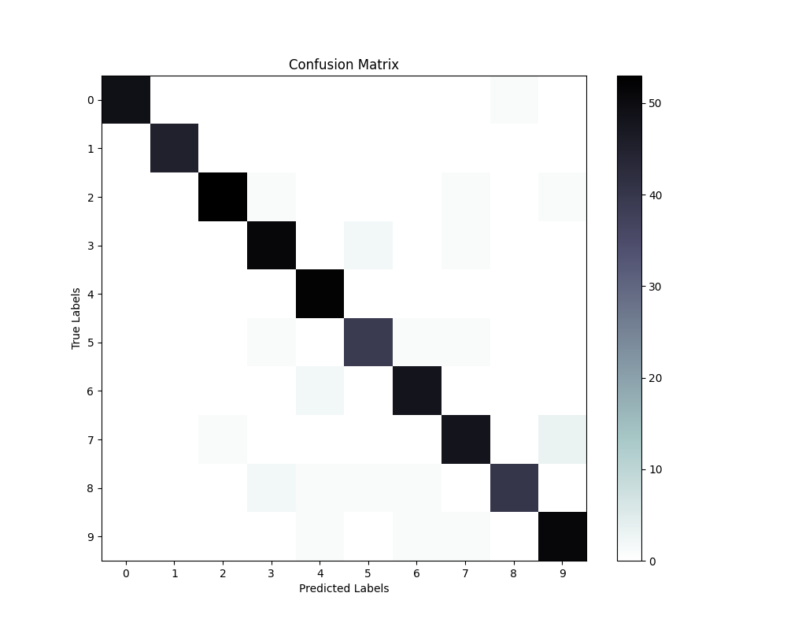

# CNN-for-detecting-digits-in-images
The goal of this project was to implement various layers of a CNN to detect digits in images.  Due to copyright, the code for this assignment is unavailable.  

Layers that were implemented: 
- Forward Inner Product
- Backward Inner Product
- Forward Convoltuional Layer
- Forward Max Pooling Layer
- Forward ReLU Activation
- Backward ReLU Activation 

The trained model is attached in the `lenet.mat` file and all results can be viewed below. 

Confusion Matrix:
